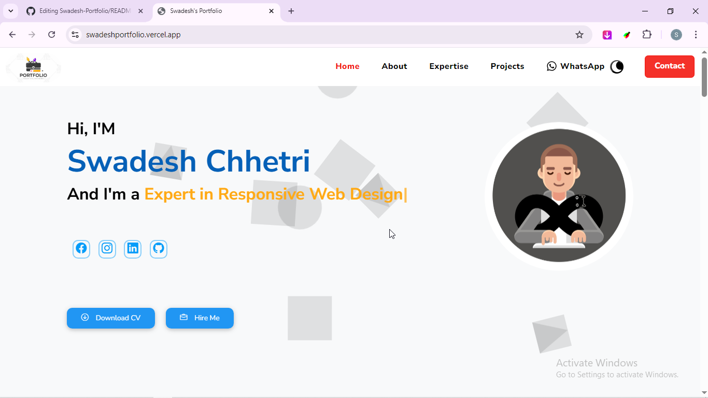
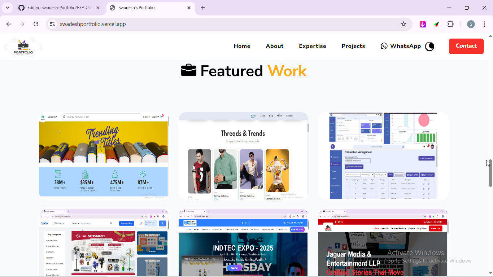

# 💼 Swadesh Chhetri - Portfolio

Welcome to my **personal portfolio website**, a place where I showcase my journey as a Full-Stack Developer — my skills, projects, certifications, and how to get in touch!

---

## 🌟 Overview

This is a fully responsive, modern portfolio built using **Next.js**, **Tailwind CSS**, and **Framer Motion**. It highlights:

- About Me  
- Skills & Tools  
- Projects  
- Certificates  
- Contact Details  

---

## 🚀 Tech Stack


---

## 📁 Sections

### 🧑‍💻 About Me
A short introduction about who I am, my journey, passions, and goals as a developer.

### 🧰 Skills
A showcase of my development stack, tools I use, and technologies I’m experienced with.

### 💼 Projects
A collection of my best projects including:

- **QuickCart** – An ecommerce platform  
- **Finance Portal** – Transaction management with visual reports  
- **E-BookStore** – Digital book-selling platform  

Each project includes a live demo and source code.

### 📜 Certificates
Verified certificates earned from online platforms and internships.

### 📇 Contact
Easy-to-access contact options including:

- Email  
- LinkedIn  
- Resume download  

---

## 📸 Screenshots

> *(Optional: Add image previews of your website using markdown)*

```markdown


